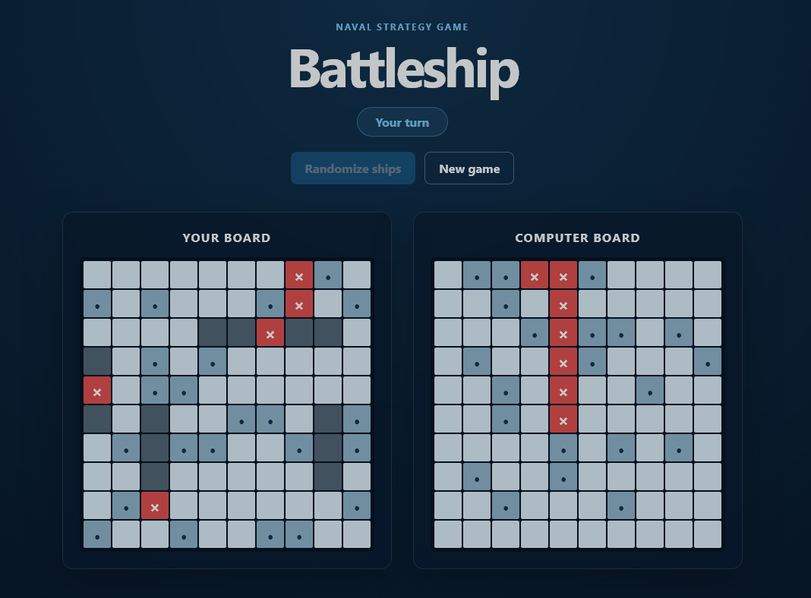

# Battleship

A browser-based Battleship game built with JavaScript and test-driven development.

[Live Demo](https://thadmelaku.github.io/battleship/)

## Features

- Play against a computer
- Random ship placement
- Hit and miss tracking
- Win and loss detection
- Responsive layout

## Built With

- JavaScript
- HTML and CSS
- Jest
- webpack